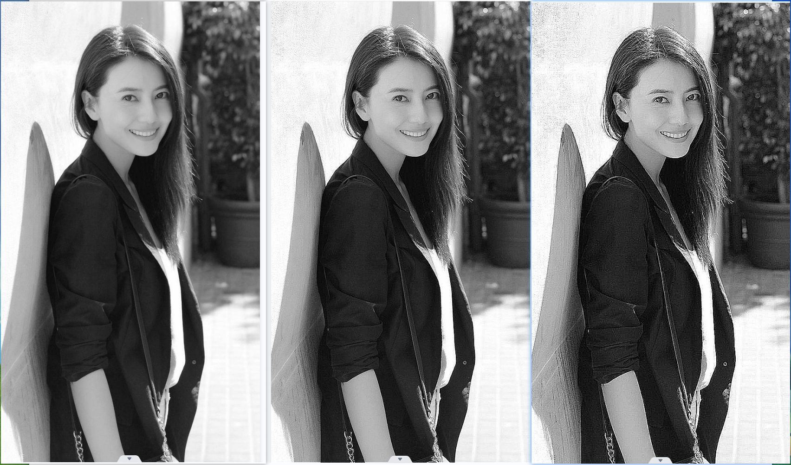

# digital_image_processing
## gray transformation
### add the histogram equalization and histogram match
### add local histogram transformation
### add the content of histogram local thread and statistics
### add the content of some general gray transformation function

## 仿射变换

## 滤波
### 相关和卷积
### A图像，b滤波核或者卷积核
### 卷积核和滤波核的区别是旋转180度。
### 滤波操作，不符合交换律。卷积操作符合交换律
```
1 0 1   1 1 0
0 0 1   0 1 0
1 1 0   1 1 0

A         B
```

### PADDING, 完全相关,相似卷积
```
(original_image_size + 2*padding - kernel_size) / step + 1 = original_image_size;
```
### 
```
kernel_size / 2;向下取整，int padding_size = kernel_size / 2;
```

### 平滑空间滤波
### 均值滤波，（中值滤波，类似于灰度变换,统计形式的滤波）
```
1 255 1 1 
1 20 20 1
1 1  1  1
1 5  1  1
```
### 为什么要有滤波？其实滤波只是将之前的灰度变换形式化。
### sum(gray(x, y)) / n
### 3*3, 均值滤波，盒状滤波器（滤波核像素点均相等）
```
1 1 1
1 1 1 * 1/9)
1 1 1
```
### 权重滤波。约定速成的距离概念，横轴和纵轴是最近的两个维度，两个斜轴上的
### 灰度值比横轴纵轴上的值距离中心点远一点。
```
1 2 1
2 4 2  * 1/16)
1 2 1
中心点
```

### 椒盐噪声
### 中值滤波
### 1 2 2 2 2 30 30， 中值是2， 均值比2大。

## 锐化空间滤波器（二阶微分和梯度）
### 1、二阶微分和梯度在图片边缘检测方面的区别
```
1 1 2 3 4 5 6 10 10 10
0 0 1 1 1 1 1 4 0 0
0 0 1 0 0 0 0 3 -4 0

f(x)
df/dx = f(x+1)-f(x)
d^2f/dx^2 = f(x+1)+f(x-1)-2f(x)

f(x, y)
df/dx = f(x+1, y)-f(x, y)
df/dy = f(x, y+1)-f(x, y)

d^2f/dx^2=f(x+1, y)+f(x-1, y)-2f(x, y)
d^2f/dy^2=f(x, y+1)+f(x, y-1)-2f(x, y)

3*3
f(x-1, y-1)  f(x, y-1)   f(x+1, y-1)
f(x-1, y)    f(x, y)      f(x+1, y)
f(x-1, y+1)  f(x, y+1)   f(x+1, y+1)

0   1   0
1   -4  1
0   1   0

1   1   1
1   -8  1
1   1   1
拉普拉斯算子计算得到原始图像的二阶微分即图像的边缘检测结果

在原始图像的基础上加上或者减去边缘检测结果，即可达到图像锐化的效果
g(x, y) = f(x, y) + c * laplas_result(边缘检测结果) 
c = -1/1(laplas算子中心点的符号)
```

### 2、使用梯度进行边缘增强
```
3*3

z1 z2 z3
z4 z5 z6
z7 z8 z9

df/dx = z8-z5
df/dy = z6-z5
[df/dx, df/dy]
梯度向量的幅度值表示的就是图像像素点变化的强度，也即边缘的强度
value_[df/dx, df/dy] = value_[gx, gy] = (gx^2+gy^2)^(1/2)
{
根据阈值和幅度值将原始图像二值化（0， 255）
阈值的选择标准：自适应标准（扫描到的区域统计值，比如均值等等）
}
原始计算得到的幅度值 result_image(-∞, +∞), original_image(0, 255)
sum(result_image, original_image), range to(0, 255)

z1 z2 z3
z4 z5 z6
z7 z8 z9

原始：
df/dx = z8-z5
df/dy = z6-z5
[df/dx, df/dy]
罗伯特交叉算子：
df/dx = z9-z5
df/dy = z8-z6

2*2
-1 0       0 -1
0 1       1 0
df/dx      df/dy

一个算子行吗
-1 -1
1 1


z1 z2 z3
z4 z5 z6
z7 z8 z9
3*3

df/dx = (z7-z1) + 2(z8-z2) + (z9-z3)
df/dy = (z3-z1) + 2(z6-z4) + (z9-z7)
value_[df/dx, df/dy] = [[(z7-z1) + 2(z8-z2) + (z9-z3)]^2 + [(z3-z1) + 2(z6-z4) + (z9-z7)]^2]^(1/2)
3*3
-1 -2 -1        -1  0   1
0   0  0        -2  0   2
1  2   1        -1  0   1
soble算子

好像没声音了，也快结束了，刚才的问题是我传递的参数是
cv::Mat_<double>(3, 3)
empty()
导致这个函数返回的是false
我们修改下重新测试下，就结束了
我刚才测试了下cv::Mat_<double>() 传递这个形参empty方法会返回true
编译下

可以发现laplas边缘检测的效果没有梯度边缘检测的效果好
但是laplas更加侧重于图像的纹理细节检测
这次测试的laplas的效果好像和昨天测试的不一样，可能是因为我修改代码那块没有做好兼容
我下面完善下代码。。。
好的今天的内容到此结束

下周进行图像增强的应用，结合低通滤波（均值滤波、中值滤波）、高通滤波（二阶微分、梯度）进行图像的增强
也可以称之为混合图像增强方法。再见
```

